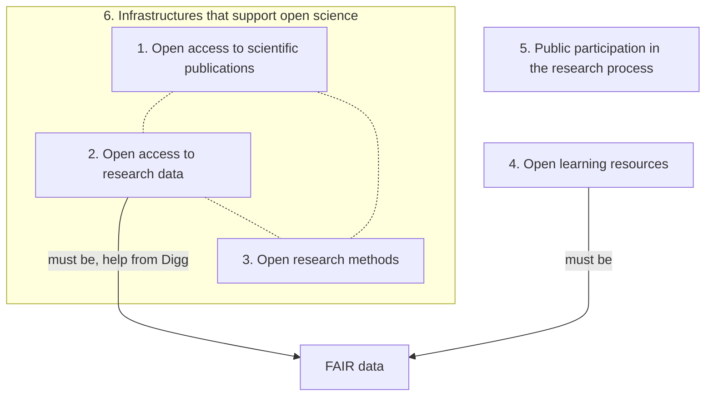

# open_science_presentation_osu_20240315

My Open Science presentation for Open Science Uppsala on 2024-03-15.

## Form

The idea is to have a discussion on 
[the Swedish national guidelines on Open Science](https://www.kb.se/samverkan-och-utveckling/nytt-fran-kb/nyheter-samverkan-och-utveckling/2024-01-15-national-guidelines-for-promoting-open-science-in-sweden.html).
To achieve this, me and Martin Johnsson both prepare a
presentation, from opposite perspectives.
By coin toss, Martin got the role of 'positive' and I got
the role of 'negative' on the guidelines, 
before reading these.

## Sketch

This is a sketch of my talk. It will change. In it's current state, it is crap.

### History

Started June 2022.

### Other facts

 * Open Science guidelines were developed as a link between what exists and the UNESCO guidelines for doing Open Science.
 * The letters sent to KB asking for feedback were mostly about:
    * dealing with the 
      costs of open publications, open data, open infrastructure and long-term
      projects
    * a lack of rewards system for Open Science


### TOC 

Of [KB, 2024a]

```
Nationella riktlinjer för öppen vetenskap - för att främja och stärka forskningen  
- Förutsättningar för öppen vetenskap  
- Genomförande på övergripande nivå  
- Nuläge och utveckling 
Områden inom öppen vetenskap  
- Öppen tillgång till vetenskapliga publikationer  
- Öppen tillgång till forskningsdata  
- Öppna forskningsmetoder  
- Öppna lärresurser  
- Allmänhetens delaktighet i forskningsprocessen  
- Infrastrukturer som stödjer öppen vetenskap  
Aktörer och deras ansvarsområden  
- Forskare  
- Forskningsutförande organisationer  
- Forskningsfinansiärer  
- Expertmyndigheter 
- Övriga myndigheter och aktörer  
Stöd och vägledning  
- Policyer och strategier  
- Utbildning och vägledning  
- Resurser och riktade satsningar  
```

```
National guidelines for open science - to promote and strengthen research
- Prerequisites for open science
- Implementation at an overall level
- Current situation and development
Areas within open science
- Open access to scientific publications
- Open access to research data
- Open research methods
- Open learning resources
- Public participation in the research process
- Infrastructures that support open science
Actors and their areas of responsibility
- Researchers
- Research execution organizations
- Research funders
- Expert authorities
- Other authorities and actors
Support and guidance
- Policies and strategies
- Training and guidance
- Resources and targeted investments
```

## Summary

### Why Open Science

> Syftet med arbetet för
> öppen vetenskap är att bidra dels till ökad vetenskaplig kvalitet, dels att förbättra samspelet
> mellan forskningen och det omgivande samhället. Genom öppen vetenskap läggs en grund
> för framtida forskning byggd på transparens, reproducerbarhet och ökade möjligheter att ta
> del av vetenskaplig information [KB, 2024a]

References?

### UNESCO Open Science Definition

For the purpose of this Recommendation, open science is defined as an inclusive construct that combines various movements and practices aiming to make multilingual scientific knowledge openly  available,  accessible  and  reusable  for  everyone,  to  increase  scientific  collaborations  and  sharing of information for the benefits of science and society, and to open the processes of scientific knowledge creation, evaluation and communication to societal actors beyond the traditional scientific community [UNESCO, 2021]. 

### UNESCO guidelines

1. Transparency, scrutiny, critique and reproducibility
2. Equality of opportunities
3. Responsibility, respect and accountability
4. Collaboration, participation and inclusion
5. Flexibility
6. Sustainability

### KB Guidelines


> Områden inom öppen vetenskap
> - Öppen tillgång till vetenskapliga publikationer
> - Öppen tillgång till forskningsdata
> - Öppna forskningsmetoder
> - Öppna lärresurser
> - Allmänhetens delaktighet i forskningsprocessen
> - Infrastrukturer som stödjer öppen vetenskap
> From [KB, 2024a]

Areas within open science

- P1. Open access to scientific publications
- P2. Open access to research data
- P3. Open research methods
- P4. Open learning resources
- P5. Public participation in the research process
- P6. Infrastructures that support open science



## P1. Open access to scientific publications

Open access to scientific publications, goals and priorities:

- That all types of scientific publications that are wholly or partially produced with
public funds must be published with immediate open access.
- That publication takes place with an open license, in accordance with the FAIR principles and with
support in guiding information from the Royal Library.
- That costs associated with open access publication are not covered by either
readers or individual authors
- That costs associated with publication should be transparent and reduce over time
without impacting Swedish researchers' opportunities to disseminate research results in the form of
scientific publications.
- That measures are taken that promote authors retaining the economic copyright
to his works.


'5.1 Öppen tillgång till vetenskapliga publikationer'

[KB, 2024b,5.1] 'Under 2022 publicerades omkring 70
procent av alla svenska vetenskapliga artiklar med öppen tillgång'.
Symbol politics?

[KB, 2024b,5.1] 'De transformativa avtalen har
också visat sig leda till fortsatt ökade kostnader för vetenskaplig publicering istället för att
minska.'. 
So it has gotten more expensive in general!

Open access is governed by among others Bibsamkonsortiet.
However, Bibsamkonsortiet does not take into account books.
Hence, there is no budget to make books open:
this has to come from the researchers' funding.

Why is this useful? How much does this improve?

## P2. Open access to research data

[KB, 2024a, p 10] 'Det bidrar till att höja forskningens kvalitet genom att fler forskare kan
validera och bygga vidare på tidigare resultat'.
Is that so? How much?

[KB, 2024a, p 10] 'Användning och vidareutnyttjande av data kan skapa transparens,
innovation, effektivisering och underlag till beslut och forskning.'
Is this toning down?

- That research data produced within the framework of publicly funded research by 2026 at the latest is made available according to the principle "as open as possible, as limited as necessary".
- That the making of research data, including metadata, takes place in accordance with the FAIR principles and with the support of guidance information from the Swedish Research Council and the Agency for Digital Management (Digg).
- That strategic orientations, supporting and technical measures that create conditions for open access to research data exist at all appropriate levels and in working methods, processes and routines.
- That cost-effective management of open access to research data is ensured. In the first place, costs associated with making data openly available according to the FAIR principles should be clearly identified.
- That research-performing organizations, including research infrastructures, give researchers access to adequate support, knowledge-raising initiatives and reliable, appropriate and interoperable technical solutions that enable openly available research data according to the FAIR principles.

'That cost-effective management of open access to research data is ensured'.
Sure, how you gonna guarantee that...?

'Datahanteringsplaner är ett verktyg som underlättar
dokumentation inför, under och efter ett forskningsprojekt. De är tänkta att vara ett stöd för forskaren och forskargruppen i att på ett strukturerat sätt dokumentera olika centrala datahanteringsmoment och frågor. De kan därmed underlätta planering, genomförande och framtida användning och åtkomst av forskningsdata.' [KB, 2024b, p10]
So they only may be ...?

'I Sverige finns öppen tillgång till forskningsdata som ett forskningspolitiskt mål sedan
propositionen 2016'
So, has anyone noticed?
'Till skillnad från forskningspublikationer kvarstod målbilden om att öppen tillgång till
forskningsdata ska vara genomförd fullt ut 2026 i den senaste propositionen från 2020'
So it will be mandatory in 2026?

'SUHF lyfter i sin färdplan för öppen vetenskap bland annat att lärosätena ska bidra till att forskningsdata uppfyller FAIR-principerna. Vidare ska de erbjuda prisvärda, adekvata och säkra infrastrukturella tjänster – som uppfyller gällande regelverk och FAIR-principerna – för hantering, lagring, tillgängliggörande och bevarande av forskningsdata.'
So SUHF will provide the infrastructure...


All data needs to 'as open as possible,
as closed as needed' ('så öppet som möjligt, så begränsat som nödvändigt').

Needs to make data FAIR and/or add metadata.
People will help.

Admin?

## P3. Open research methods

- That methods, protocols and program code are made available as openly as possible and as limited as necessary to guarantee transparency regarding the data collection and analysis process.
- That research methods are always documented and made available at a sufficiently detailed level.
- That research methods are made available in such a way and with sufficient metadata that the FAIR criteria are met.
- That research-performing organizations, including research infrastructures, give researchers access to adequate support, knowledge-raising initiatives and reliable, appropriate and interoperable technical solutions that enable openly accessible research methods.
- That standards for sharing research methods are used and developed within and based on experiences from different research areas and with regard to international development.
- That reuse of research methods is facilitated by open licenses is used and indicated where applicable.

### P4. Open learning resources

- That universities and colleges have policies and guidance for the production and use of open learning resources.
- Open learning resources and their metadata are shared with open licenses and to the extent possible in accordance with the FAIR principles, with the aim of promoting dissemination and reuse.
- That the work with open learning resources at universities and colleges is coordinated.
- That the need for and conditions for a joint platform to gather and disseminate open learning resources are investigated.

### P5. Public participation in the research process

- That principles and methods for how the public can be involved in the research process are developed, known and established within all research disciplines where it is relevant to the quality and development of the research.
- That research-performing organizations offer developed methodological support and knowledge-raising efforts for researchers about how the public can be involved in the research process.
- That research funding organizations develop policies and assessment criteria around collaboration, co-creation and public participation in the research process.

Why is the general populace important for science?

### P6. Infrastructures that support open science

- That international services and infrastructures that support open science are financed nationally in a coordinated manner.
- That non-profit infrastructures for open access publishing should be particularly supported.
- That infrastructures that enable adequate and future-proof sharing of open research methods are developed.
- That standards and technical solutions that link together publications, research data and methods are used and developed.

### Criticism: Swedish only?

Quite inclusive, a Swedish-only proposal!
[some percentage] of researchers in Sweden is non-Swedish.
English is the lingua franca of science.
Shouldn't 'Other authorities and actors' have translated this?

### Criticisms: unconvincing without references

We are scientists. When someone says 'X makes Y better', we ask questions
such as 'How much better?', 'Which experiment determined this?' and
'Could you give me the reference to the paper claiming this?'.
This document does not do this at all.

### Critism: Open Science worth it at all?

OTOH, has nothing to do with guidelines

## References

 * [UNESCO, 2021] Recommendation on Open Science, 2021-11-23. [here](https://www.unesco.org/en/legal-affairs/recommendation-open-science)
 * Nationella riktlinjer för öppen vetenskap, KB,  [here](https://www.kb.se/samverkan-och-utveckling/nytt-fran-kb/nyheter-samverkan-och-utveckling/2024-01-15-national-guidelines-for-promoting-open-science-in-sweden.html)

 * [KB, 2024a] Nationella riktlinjer för öppen vetenskap. Kungliga biblioteket. kb.se/oppenvetenskap. Diarienummer: KB 2024-42. ISBN: 978-91-7000-482-7. URN: https://urn.kb.se/resolve?urn=urn:nbn:se:kb:publ-722 (pdf)

 * [KB, 2024b] Rapport om nationella riktlinjer för öppen vetenskap. Bakgrund och framtagande. Kungliga biblioteket. kb.se/oppenvetenskap. Diarienummer: KB 2024-42. ISBN: 978-91-7000-481-0. URN: https://urn.kb.se/resolve?urn=urn:nbn:se:kb:publ-721 (pdf)
